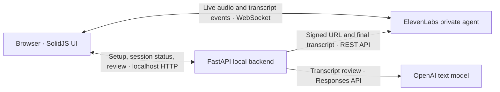

# Voice Language Tutor

Practice a language by talking with a tutor in your browser, then get feedback on what you
said. Choose a target language, your native language, a CEFR level, and a topic. Click **Start**
to speak, follow the live transcript, and use **Mute** or **End** whenever you need to.

After you end the call, the app retrieves the final transcript and prepares a review: a short
summary, up to five corrections, up to eight vocabulary items, and three next topics. Corrections
quote your actual speech. Explanations use your native language; corrections and examples use
the target language. Generated vocabulary examples are labeled. A review can suggest no corrections.
CEFR is guidance for the tutor, not a proficiency score; the app does not score pronunciation.

The app runs locally on your computer. Live audio is handled by ElevenLabs and text reviews by
OpenAI, so live practice requires internet access and API access to both services. A visibly labeled
simulation mode lets you try the screens with a sample transcript and review without a microphone
or provider calls.

## Architecture



The browser captures microphone audio and plays the tutor's voice through the official
`@elevenlabs/client` SDK. Audio travels directly to ElevenLabs. Its private agent manages speech
recognition, conversation responses, turn taking, interruptions, and speech generation. The
conversation model is an OpenAI model selected in the ElevenLabs dashboard and run by ElevenLabs.

FastAPI serves the built frontend and the local session API. It holds provider credentials,
obtains a signed WebSocket URL for the browser, and associates each local session with its
ElevenLabs conversation. After End, it retrieves the finalized transcript and sends its text to
OpenAI for a separate review. OpenAI is used for text analysis in this backend; all live voice
handling belongs to ElevenLabs.

| Element | Role |
| --- | --- |
| SolidJS + TypeScript frontend | Setup form, call controls, live transcript, progress/errors, and review display. |
| Local FastAPI routes | Validate requests and expose session creation, start/end, status, and review retry. |
| Session service | Keep in-memory session state; run one background transcript/review task per session; bound waits and prevent duplicate analyses. |
| Review service | Normalize transcript speakers and turn IDs; check that corrections quote learner turns and vocabulary appears in its cited turn. |
| ElevenLabs client | Call the signed-URL endpoint and retrieve finalized conversation details with safe errors and timeouts. |
| OpenAI review client | Request a structured review through the Responses API and handle refusal, incomplete output, and provider errors. |
| Prompt files | Define the voice tutor's behavior and the rules for grounded text feedback. |

The external APIs are ElevenLabs `GET /v1/convai/conversation/get-signed-url` and
`GET /v1/convai/conversations/{conversation_id}`, the ElevenLabs SDK's live WebSocket connection,
and OpenAI `POST /v1/responses` via `responses.parse(text_format=Review)`.
The OpenAI request uses `store=false`. Provider keys stay in the backend; the browser receives
only the temporary voice connection descriptor and session results.

## Install and run

The application uses standard Python, Node, and browser APIs. It is intended to run on Linux,
macOS, or Windows through WSL.The current environment has been checked on WSL;
macOS has not been tested here.

You need uv, make, curl, and tar. Python 3.12 and Node are pinned in `.python-version` and
`.node-version`. Python packages live in `.venv`, the project-local Node runtime in `.tools/node`,
and frontend packages in `frontend/node_modules`. Setup does not install packages system-wide.

From the repository directory:

```bash
make install-node  # download and verify the pinned project-local Node runtime
make setup         # locked dependencies, frontend build, .env if it does not exist
make serve
```

Open **http://localhost:8000** in a modern browser on the same computer. On WSL, use your Windows
browser. Stop the server with Ctrl+C. FastAPI serves the frontend, so regular use needs just this
one server process. It binds to `127.0.0.1`; both localhost and 127.0.0.1 browser origins are accepted
on port 8000.

The default `.env` uses `APP_MODE=fake`. Click Start and End to try the simulation. For live
practice, follow the [required ElevenLabs setup](docs/elevenlabs-setup.md), then edit the ignored
local `.env` to supply both provider keys, `ELEVENLABS_AGENT_ID`, and an `OPENAI_REVIEW_MODEL`
that supports Responses structured output. Set `APP_MODE=live` and restart the server.
Keep `.env` private with mode 600; `make setup` creates it with that mode and preserves existing files.
Missing live settings fail startup with the missing field names. Simulation never silently switches
to paid calls. ElevenLabs conversation usage and the separate OpenAI review request use their
respective API billing.

## Development and checks

| Command | Purpose |
| --- | --- |
| `make check` | Ruff lint/format, Python mypy, TypeScript checker, offline tests, and frontend build. |
| `make test` | Fake-client tests and mocked provider HTTP contracts; no live calls. |
| `make build-web` | Rebuild the generated frontend assets served by FastAPI. |
| `make run` | Start the local server with development reload. |
| `make lint`, `make types` | Run individual checks. |
| `make diagnose` | Check provider configuration without network requests. |
| `make probe-review` | Deliberately make one paid OpenAI text request on synthetic speech and validate its review. |

Frontend code is in `frontend/src`; session and review services are in
`src/voice_tutor/services`; external clients are in `src/voice_tutor/clients`.
Only `config.py` reads application environment values. Dependencies are locked in `uv.lock`
and `frontend/package-lock.json`. Generated assets, installed dependencies, and secrets are ignored.
After frontend changes, run `make build-web` and reload the browser. Backend changes require a
restart under `make serve`; `make run` reloads them automatically.

The [manual checks](docs/manual-checks.md) cover microphone permission, pauses, interruptions,
disconnects, clean End behavior, and review quality.

## Provider diagnostics

Use the CLI to check provider calls independently of a browser session:

```bash
make diagnose                                             # config only; no calls
make diagnose ARGS="--provider openai --live"               # one synthetic text review
make diagnose ARGS="--provider elevenlabs --live"           # mint a signed URL; no voice call
make diagnose ARGS="--live"                                # both checks
make diagnose ARGS="--provider elevenlabs --live --conversation-id conv_..."
```

The transcript check reads an existing finalized conversation from the configured agent. Get its
ID from the ElevenLabs dashboard and replace `conv_...`. It prints only a turn count. Minting a
signed URL reserves a conversation ID; the diagnostic does not connect a microphone or start audio.
The OpenAI check makes one potentially paid request on synthetic speech and validates both the
structured output and its evidence. `make probe-review` is a shortcut for that same check.

Each result shows PASS/FAIL, the endpoint, elapsed time, a safe error category, and the upstream
HTTP status when available. A failed check returns exit code 1. Keys, signed URLs, transcript text,
reviews, and raw provider error payloads are never printed. Missing settings are reported by name.
The checks run against the real providers only with `--live`, even if the app is in simulation mode.

The diagnostic runner shares the app's clients, configuration, schemas, and evidence validation;
there is no additional HTTP diagnostic route. Checks use the clients' existing retry policies:
OpenAI has no automatic retries; ElevenLabs permits one retry for transient failures. A successful
signed-URL check confirms API access; use the browser to verify microphone, WebSocket, and audio behavior.

## Session data and limits

Session state is kept in memory and cleared when the server stops. Browser reload loses the current
session view. Old sessions are cleaned up on subsequent session creation after two hours.
The app does not record audio or persist personal history. Audio and review text still go to their
respective cloud services; retention follows provider settings and policies. `store=false` does
not promise zero vendor retention.

This version rejects transcripts over 24,000 characters or individual turns over 1,000 characters.
Transcript retrieval and review requests have bounded deadlines and visible failure states.
Explicit retry can repeat an upstream request that timed out. Refusals and credential errors are
not automatically retried.

If a review reports unavailable OpenAI API quota, check the billing balance and usage limit of
the API project associated with your key. A ChatGPT subscription does not supply API credits.
After resolving billing, use **Retry review** on the existing session; its finalized transcript
is reused. HTTP 429 can also mean a temporary rate limit, which the app reports separately.
See [OpenAI error codes](https://developers.openai.com/api/docs/guides/error-codes).
